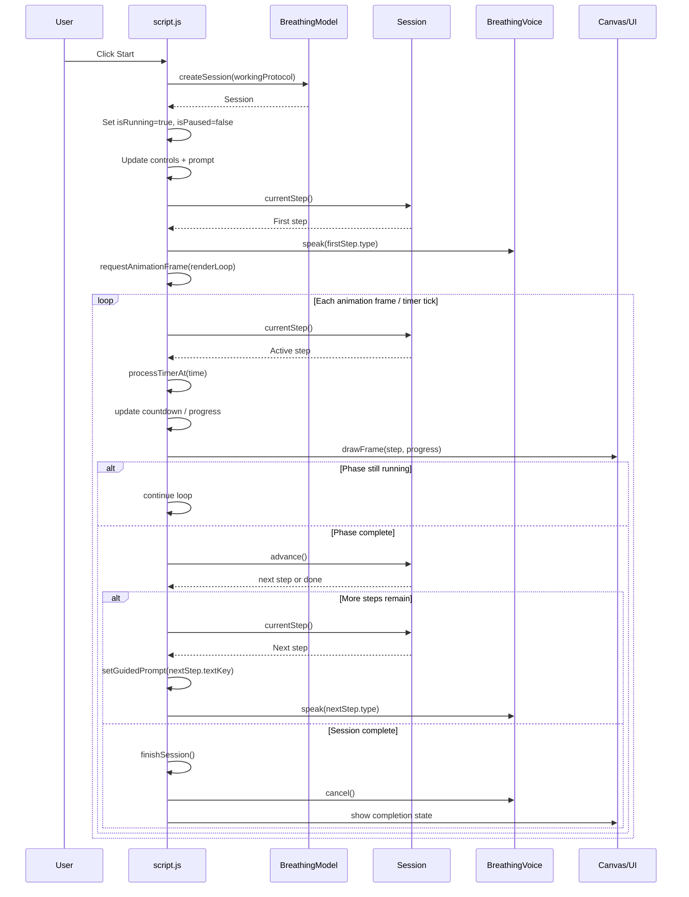

# Diagrams

## App logic

```mermaid
flowchart TD
    A[Browser loads index.html] --> B[Load scripts in order]
    B --> B1[version.js → BreathingApp]
    B --> B2[storage.js → BreathingStorage]
    B --> B3[ui-utils.js → BreathingUiUtils]
    B --> B4[voice.js → BreathingVoice]
    B --> B5[model.js → BreathingModel]
    B --> B6[script.js main controller]

    B6 --> C[DOMContentLoaded]
    C --> D[Find DOM elements]
    D --> E[Load preferences from localStorage]
    E --> F[Load selected protocol / theme / language / volume]
    F --> G[Apply accent color + translations]
    G --> H[Render protocol editor + summary]
    H --> I[Initialize canvas + resize observer]
    I --> J[Start animation loop]
    J --> K{User action}

    K -->|Start| L[Create session from selected protocol]
    L --> M[Set running state]
    M --> N[Show pause/stop controls]
    N --> O[Set first guided prompt]
    O --> P[Play voice cue]

    P --> Q[renderLoop]
    Q --> R{Running?}
    R -->|No| S[Draw idle orb]
    S --> Q

    R -->|Paused| T[Draw paused state]
    T --> Q

    R -->|Yes| U[processTimerAt()]
    U --> V[currentStep from session]
    V --> W[Update phase timer]
    W --> X[Draw animated orb/progress]
    X --> Y{Phase complete?}
    Y -->|No| Q
    Y -->|Yes| Z[Advance session]
    Z --> AA{More steps?}
    AA -->|Yes| AB[Update prompt + voice cue]
    AB --> Q
    AA -->|No| AC[finishSession()]
    AC --> AD[Mark complete + reset controls]
    AD --> Q

    K -->|Pause/Resume| AE[Toggle paused state]
    AE --> Q

    K -->|Stop| AF[Cancel voice + clear session]
    AF --> AG[Restore idle UI]
    AG --> Q

    K -->|Edit protocol| AH[Model updates blocks/phases]
    AH --> AI[Save prefs to localStorage]
    AI --> H

    K -->|Change appearance| AJ[Apply theme/accent color]
    AJ --> AI

    K -->|Change language| AK[Switch translations]
    AK --> G
```

## `script.js` flow

```mermaid
flowchart TD
    A[DOMContentLoaded] --> B[Resolve module globals]
    B --> C{All modules loaded?}
    C -->|No| D[Log error and stop]
    C -->|Yes| E[Collect DOM element references]
    E --> F[Create canvas context]

    F --> G[Initialize state variables]
    G --> H[Build voice guide]
    H --> I[Define helper functions]

    I --> I1[Color / palette helpers]
    I --> I2[Prompt transition helper]
    I --> I3[Canvas resize + cached colors]
    I --> I4[Timer helpers]
    I --> I5[Protocol editor helpers]
    I --> I6[Translation helpers]
    I --> I7[Persistence helpers]

    I --> J[Wire event listeners]
    J --> J1[Start / Pause / Stop buttons]
    J --> J2[Volume slider]
    J --> J3[Accent swatches + color picker]
    J --> J4[Preset select]
    J --> J5[Protocol editor controls]
    J --> J6[Language toggle]
    J --> J7[Keyboard shortcuts]
    J --> J8[Visibility + resize listeners]
    J --> J9[Exercise chooser menu listeners]

    J --> K[initialize()]
    K --> K1[Render version labels]
    K1 --> K2[loadPreferences()]
    K2 --> K3[syncPresetUi()]
    K3 --> K4[translatePage()]
    K4 --> K5[Set control visibility]
    K5 --> K6[Set volume slider UI]
    K6 --> K7[resizeCanvas()]
    K7 --> K8[Attach ResizeObserver]
    K8 --> K9[Start renderLoop()]

    K9 --> L[Idle render loop]
    L --> M{Running session?}
    M -->|No| N[Draw idle orb]
    N --> L

    M -->|Paused| O[Keep drawing paused state]
    O --> L

    M -->|Yes| P[processTimerAt(time)]
    P --> Q[currentStep() from session]
    Q --> R[Update phase countdown]
    R --> S[Draw active progress marker]
    S --> T{Phase complete?}
    T -->|No| L
    T -->|Yes| U[session.advance()]
    U --> V{More steps?}
    V -->|Yes| W[Update prompt + voice cue]
    W --> L
    V -->|No| X[finishSession()]
    X --> Y[Show completion state]
    Y --> L

    AA[Start button] --> AB[start()]
    AB --> AB1[Hide settings panels]
    AB1 --> AB2[Create session from workingProtocol]
    AB2 --> AB3[Set flags: running, not paused]
    AB3 --> AB4[Update UI controls]
    AB4 --> AB5[Speak first phase]
    AB5 --> AB6[updateTimerExecutionMode()]

    AC[Pause button / tap-to-toggle] --> AD[toggleSessionPause()]
    AD --> AE{Paused?}
    AE -->|Yes| AF[resume()]
    AE -->|No| AG[pause()]
    AF --> AF1[Unpause, restore prompt, speak current phase]
    AG --> AG1[Pause, cancel voice, stop background timer]

    AH[Stop button] --> AI[stop()]
    AI --> AI1[Cancel voice]
    AI1 --> AI2[Clear session]
    AI2 --> AI3[Restore idle controls]
    AI3 --> AI4[Reset display]

    AJ[Edit protocol] --> AK[Model update call]
    AK --> AL[afterProtocolEdit()]
    AL --> AL1[Invalidate cached visual phases]
    AL1 --> AL2[Re-render editor if needed]
    AL2 --> AL3[syncPracticeSummary()]
    AL3 --> AL4[updateTotalTime()]
    AL4 --> AL5[updateRemainingCycles()]
    AL5 --> AL6[savePreferences()]
    AL6 --> AL7[Update idle canvas]

    AM[Change language/theme/color/volume] --> AL

    AN[Load preferences] --> AO[Storage.readJSON()]
    AO --> AP[Restore protocol/theme/language/volume/colors]
    AP --> AQ[applyPrimaryColor()]
    AQ --> AR[refreshPresetSelect()]
    AR --> AS[syncPresetUi()]
    AS --> AT[translatePage()]

    U1[Window load] --> U2[Register sw.js]
```

## Start → tick → complete sequence


