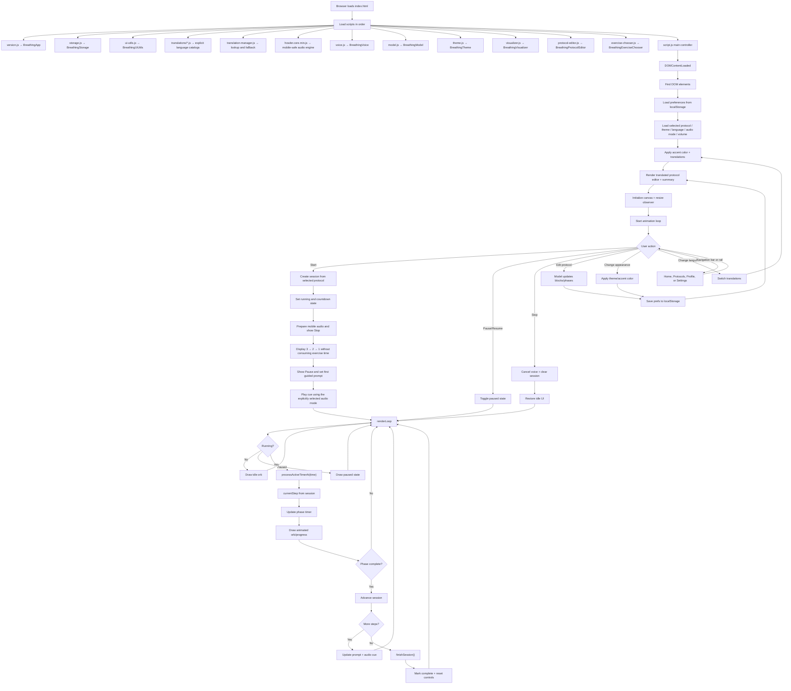
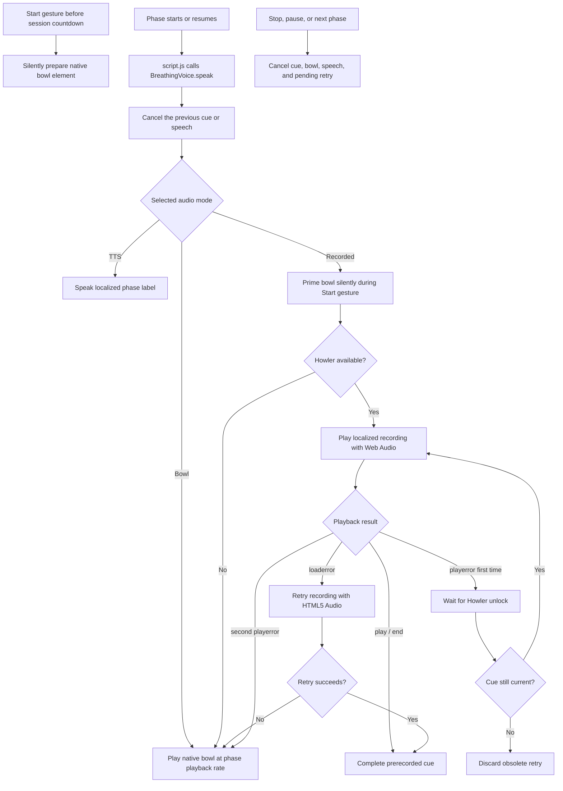
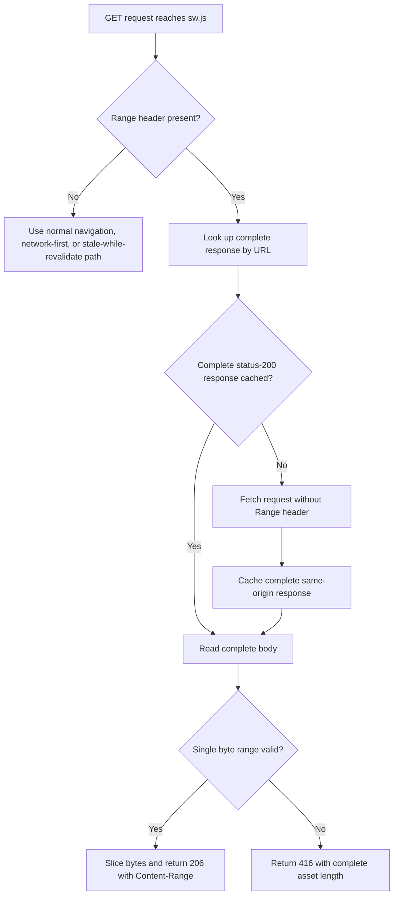
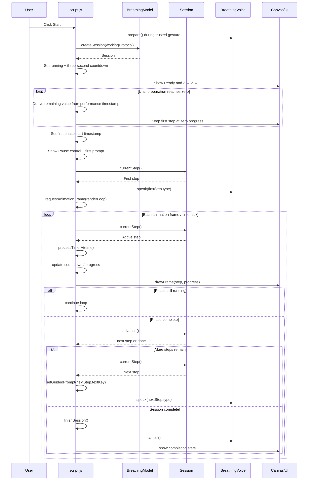

# Application logic documentation

This file is the maintained source of truth for the application's runtime
flows. Every change to session, timer, canvas, audio, storage, localization, or
PWA logic must update the affected diagram and explanation here in the same
change. User-visible behavior and setup changes must also be reflected in the
root [`README.md`](../README.md).

## App logic



There is still no bundler. Each file is a same-origin `<script>` that assigns a
`window.BreathingX` global, the same pattern as `model.js` and `voice.js`.
`theme.js` owns palette math and writes CSS custom properties.
`visualizer.js` owns orb geometry and canvas frames; it reads running/session
state through getters so the timer engine stays in `script.js`.
`protocol-editor.js` and `exercise-chooser.js` own DOM construction and call
back into the controller after edits or selection. Palette math and vertex
geometry are unit-tested in Node; the two DOM modules are organized the same
way as `Voice.createVoiceGuide` but still need a browser to assert rendered
output. All four files are in the service-worker precache so offline sessions
keep the extracted scripts.

The shell follows Material 3 Expressive scaffold: a tinted top app bar, a
content pane with margin/gutter spacing, and one navigation region. Below 840px
that region is a full-width bottom bar (active state is a pill behind the icon
only). From 840px it becomes a left rail; from 1200px the rail expands with
icon-and-label destinations. Home is the timer pane. Protocols opens the
protocol editor sheet. Profile is a placeholder sheet for future stats and
account integration. Settings opens language, audio, and appearance.
Opening Protocols, Profile, or Settings marks that destination until the
sheet closes, then Home becomes active again. Start, Pause, and Stop remain
in the content pane.

Protocols, Profile, and Settings open as **modal side sheets** over the pane
(Bootstrap offcanvas, M3 Expressive chrome). Each sheet uses a headline and
circular close with no header divider and tonal grouped cards. Settings also
has outlined fields, a language cycle chip, and a thick accent volume slider.
Scrim tap dismisses the sheet; Home and Start dismiss any open sheet. Protocols
keeps a **Guide** button that opens the full pattern catalog. On Home, a circular
**i** sits beside Remaining Cycles when the selected exercise is Box, Relaxing,
Equal, or Power rounds; that control opens a dialog with only that pattern’s
title and description. Custom and saved exercises have no Home info control.

## Audio cue flow

`BreathingVoice` offers three explicit modes. Recorded sounds are the default
and use localized `In.mp3`, `Out.mp3`, `Hold.mp3`, and `Pause.mp3` files. Bowl
mode uses `audio/tibetan-singing-bowl-54400.mp3` with different playback rates for
inhale and exhale. TTS mode uses the localized phrases and regional speech tags
from `translation-manager.js`; system speech never starts automatically.

Recorded cues first use Howler's Web Audio backend. A `loaderror` retries the
same recording once through Howler's HTML5 Audio pool because Android can report
a transient decoding or media-backend failure even when the file exists. If the
second backend also fails, or Howler is unavailable, the native bowl is used.
The bowl element is silently primed by the first recorded cue, while the Start
click still provides an Android-approved user gesture. A `playerror` waits once
for Howler's `unlock` event; another failure also uses the bowl. No file is
blacklisted for the rest of the session after a single error. Stop, pause, and
phase changes invalidate pending retries and cancel every active audio path.
Before a delayed session countdown begins, `prepare()` silently primes the bowl
element during the original Start gesture. This preserves Android media
permission until the first audible phase cue starts three seconds later.

Android's media stack requests MP3 data with an HTTP `Range` header. The service
worker stores complete audio files for offline use, then slices that complete
cached response into a standards-compliant `206 Partial Content` response. An
invalid or unsatisfiable range receives `416` with the complete asset length.
Partial responses are never cached because doing so could replace the complete
offline asset with a fragment.



## Service-worker media range flow



## `script.js` flow

```mermaid
flowchart TD
    A[DOMContentLoaded] --> B[Resolve module globals]
    B --> C{All modules loaded?}
    C -->|No| D[Log error and stop]
    C -->|Yes| E[Collect DOM element references]
    E --> F[Create canvas context]

    F --> G[Initialize state variables]
    G --> G1[Create visualizer, protocol editor, and exercise chooser factories]
    G1 --> H[Build voice guide]
    H --> I[Define helper functions]

    I --> I1[BreathingTheme palette helpers]
    I --> I2[Prompt transition helper]
    I --> I3[BreathingVisualizer canvas factory]
    I --> I4[Timer helpers]
    I --> I5[BreathingProtocolEditor factory]
    I --> I6[Translation helpers]
    I --> I7[Persistence helpers]
    I --> I8[BreathingExerciseChooser factory]

    I --> J[Wire event listeners]
    J --> J1[Start / Pause / Stop buttons]
    J --> J2[Audio mode + volume controls]
    J --> J3[Accent swatches + color picker]
    J --> J4[Preset select]
    J --> J5[Protocol editor controls]
    J --> J6[Language toggle in Settings]
    J --> J7[Keyboard shortcuts]
    J --> J8[Visibility + resize listeners]
    J --> J9["exerciseChooser.bind()"]

    J --> K["initialize()"]
    K --> K1[Render version labels]
    K1 --> K2["loadPreferences()"]
    K2 --> K3["syncPresetUi()"]
    K3 --> K4["translatePage()"]
    K4 --> K5[Set control visibility]
    K5 --> K6[Set volume slider UI]
    K6 --> K7["visualizer.resizeCanvas()"]
    K7 --> K8[Attach ResizeObserver]
    K8 --> K9["Start renderLoop()"]

    K9 --> L[Idle render loop]
    L --> M{Running session?}
    M -->|No| N[Draw idle orb]
    N --> L

    M -->|Paused| O[Keep drawing paused state]
    O --> L

    M -->|Yes| P{Preparing session?}
    P -->|Yes| P1[Update 3 → 2 → 1 from absolute timestamp]
    P1 --> P2{Countdown complete?}
    P2 -->|No| L
    P2 -->|Yes| P3[Start first phase + show Pause + play cue]
    P3 --> L
    P -->|No| Q[currentStep() from session]
    Q --> R[Update phase countdown]
    R --> S[Draw active progress marker]
    S --> T{Phase complete?}
    T -->|No| L
    T -->|Yes| U["session.advance()"]
    U --> V{More steps?}
    V -->|Yes| W[Update prompt + voice cue]
    W --> L
    V -->|No| X["finishSession()"]
    X --> Y[Show completion state]
    Y --> L

    AA[Start button] --> AB["start()"]
    AB --> AB0[Prepare audio during trusted Start gesture]
    AB0 --> AB1[Hide settings panels]
    AB1 --> AB2[Create session from workingProtocol]
    AB2 --> AB3[Set running + countdown flags]
    AB3 --> AB4[Show Stop and initial value 3]
    AB4 --> AB5[Keep Pause hidden and defer first cue]
    AB5 --> AB6["updateTimerExecutionMode()"]

    AC[Pause button / tap-to-toggle] --> AD["toggleSessionPause()"]
    AD --> AE{Paused?}
    AE -->|Yes| AF["resume()"]
    AE -->|No| AG["pause()"]
    AF --> AF1[Unpause, restore prompt, speak current phase]
    AG --> AG1[Pause, cancel voice, stop background timer]

    AH[Stop button] --> AI["stop()"]
    AI --> AI1[Cancel voice]
    AI1 --> AI2[Clear session]
    AI2 --> AI3[Restore idle controls]
    AI3 --> AI4[Reset display]

    AJ[Edit protocol] --> AK[Model update call]
    AK --> AL["afterProtocolEdit()"]
    AL --> AL1[Invalidate cached visual phases]
    AL1 --> AL2["protocolEditor.render if needed"]
    AL2 --> AL3["syncPracticeSummary()"]
    AL3 --> AL4["updateTotalTime()"]
    AL4 --> AL5["updateRemainingCycles()"]
    AL5 --> AL6["savePreferences()"]
    AL6 --> AL7[Update idle canvas]

    AM[Change language/theme/color/audio mode/volume] --> AL

    AN[Load preferences] --> AO["Storage.readJSON()"]
    AO --> AP[Restore protocol/theme/language/audio mode/volume/colors]
    AP --> AQ["Theme.applyPrimaryColor + swatch/canvas glue"]
    AQ --> AR["refreshPresetSelect()"]
    AR --> AS["syncPresetUi()"]
    AS --> AT["translatePage()"]

    U1[Window load] --> U2[Register sw.js]
```

## Start → tick → complete sequence


