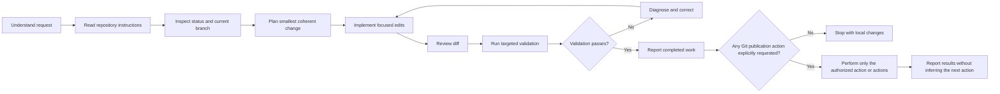
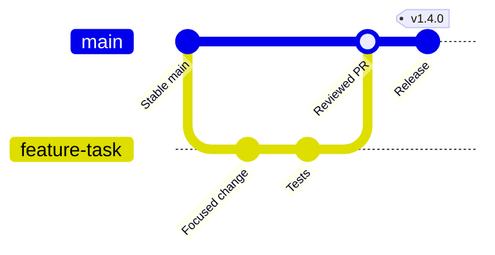
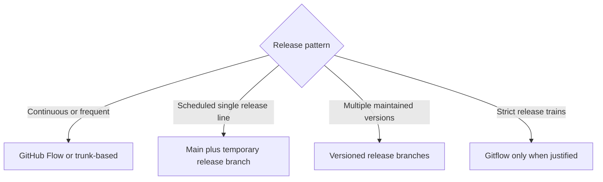
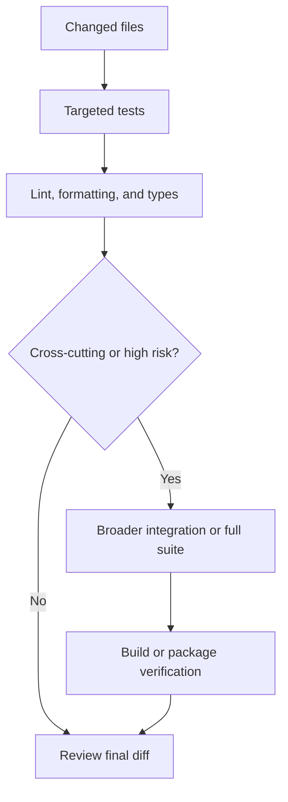
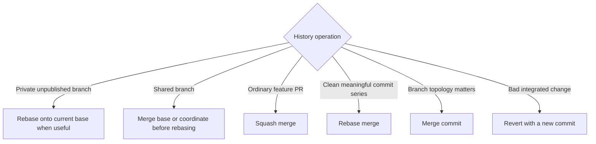
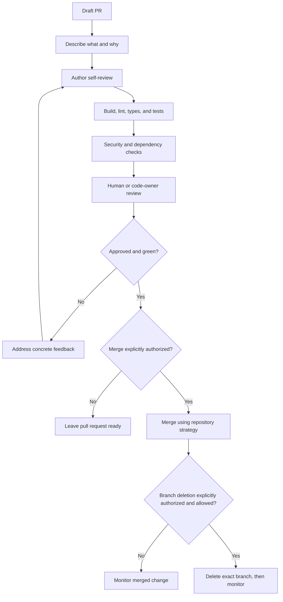
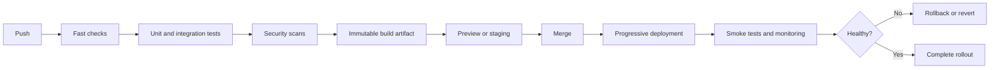
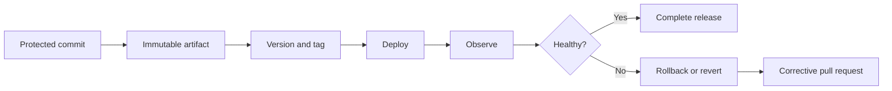
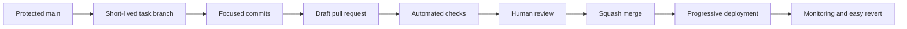

# Git Workflow Reference for Agents

This is the detailed Git workflow referenced by `AGENTS.md`. Use it whenever an
agent inspects, modifies, reviews, or publishes work in this repository.
Repository-specific instructions in `AGENTS.md` take precedence if the documents
conflict.

## Core principles

1. Preserve user work. Treat existing changes and untracked files as user-owned unless proven otherwise.
2. Inspect before changing. Understand repository state, local instructions, branch policy, and relevant tests first.
3. Keep changes scoped. Do not mix unrelated refactors, formatting, dependency updates, or generated files into the requested work.
4. Prefer small, reversible changes with clear validation.
5. Never infer permission to commit, push, create a pull request, merge, release, or delete branches.
6. Never rewrite shared history unless the user explicitly requests it and the exact scope is confirmed.
7. Never expose secrets, credentials, private keys, tokens, personal data, or proprietary data in commits, logs, or pull requests.

## Authority boundaries

An instruction to edit or fix code normally authorizes local file changes and relevant non-destructive validation. It does **not** automatically authorize repository publication.

| Action | Default agent behavior |
| --- | --- |
| Read repository files and Git status | Allowed when relevant |
| Edit in-scope files | Allowed when the user requested a change |
| Run relevant non-destructive tests | Allowed when relevant |
| Create or switch branches | Ask unless explicitly requested or required by repository instructions |
| Commit | Only when explicitly requested |
| Push | Only when explicitly requested |
| Open or update a pull request | Only when explicitly requested |
| Merge or close a pull request | Only when explicitly requested |
| Tag, publish, deploy, or release | Only when explicitly requested |
| Delete branches, tags, or files | Confirm exact targets and authorization first |
| Force-push or rewrite shared history | Avoid; require explicit authorization |

Authorization is action-specific: permission to perform one publication action
(for example, pushing a branch) does not authorize another (such as committing,
opening a pull request, merging, or deleting a branch). Workflow diagrams show
ordering only and never grant authorization by themselves.

## End-to-end workflow



## 1. Repository inspection

Before editing:

- Locate and read applicable `AGENTS.md`, `CONTRIBUTING.md`, `README`, and workflow documentation.
- Inspect the current branch, status, remotes, and recent history.
- Identify staged, unstaged, and untracked user changes.
- Determine the relevant build, test, lint, type-check, and formatting commands.
- Check whether generated files, migrations, changelogs, or documentation are expected.
- Do not modify unrelated dirty files merely to make the working tree clean.

Useful read-only commands:

```text
git status --short --branch
git diff --stat
git diff
git diff --cached
git log --oneline --decorate -n 15
git remote -v
```

If the working tree is dirty, work around unrelated changes. If requested work overlaps ambiguous user changes, stop and ask before overwriting them.

## 2. Branch strategy

For most repositories, use protected `main` with short-lived branches and pull requests.



Recommended branch names:

```text
feature/APP-123-login-page
fix/APP-417-login-timeout
refactor/payment-service
docs/authentication-guide
test/checkout-regression
chore/update-dependencies
hotfix/security-header
```

Branch rules:

- Follow any branch prefix or naming convention required by the repository or
  active agent environment.
- Start from the correct and current base branch.
- Use one branch per coherent outcome.
- Prefer branches lasting hours or days, not weeks.
- Keep branches synchronized before final integration.
- Delete merged branches only when repository policy allows it and the user has
  authorized the exact deletion.
- Do not commit directly to protected branches.
- Do not switch branches if doing so could disturb existing user changes.

### Selecting a branching model



Prefer GitHub Flow or trunk-based development. Add `develop`, long-lived release branches, or full Gitflow only when the product's release model requires the extra coordination.

## 3. Editing safely

- Make the smallest change that fully satisfies the request.
- Preserve established style, architecture, and public interfaces unless the task requires changing them.
- Separate behavioral changes from mechanical formatting.
- Do not update dependencies opportunistically.
- Do not regenerate broad outputs unless required.
- Include error handling, tests, documentation, and migrations when they are part of a complete implementation.
- Avoid destructive Git commands such as `git reset --hard` and `git checkout -- <file>` when user work could be lost.

## 4. Diff review

Before declaring completion or creating a commit, inspect the actual diff.

Check for:

- Unrequested files or changes.
- Debug statements, temporary files, or commented-out code.
- Secrets, tokens, private endpoints, or personal information.
- Accidental line-ending or whole-file formatting changes.
- Missing tests, documentation, migrations, or generated outputs.
- Error paths, compatibility issues, and security regressions.
- Changes that are correct locally but incomplete operationally.

## 5. Validation

Run validation proportional to risk:



- Start with the smallest relevant tests for fast feedback.
- Expand validation for shared APIs, schemas, concurrency, authentication, permissions, data handling, and infrastructure.
- Do not claim tests passed if they were not run.
- Report skipped or blocked checks and the reason.
- Treat flaky tests as real reliability problems; do not rerun until green without investigation.
- Never weaken or remove tests merely to make the pipeline pass unless requirements changed and the reason is documented.

## 6. Commits

Create commits only when requested.

A good commit is:

- Atomic: one coherent change.
- Buildable and testable where practical.
- Free of secrets and unrelated changes.
- Explained by intent, not file operations.
- Easy to revert independently.

Suggested message format:

```text
fix(auth): handle expired refresh tokens

Return the user to sign-in when token renewal fails instead of
repeatedly retrying the request.

Fixes APP-417
```

Common Conventional Commit types:

- `feat`: new behavior
- `fix`: defect correction
- `refactor`: internal restructuring without intended behavior change
- `test`: test-only change
- `docs`: documentation
- `perf`: performance improvement
- `build`: build system or dependency changes
- `ci`: automation changes
- `chore`: maintenance

Commit rules:

- Use an imperative description after the Conventional Commit prefix, normally
  lowercase: `add`, `fix`, `remove`, `prevent`.
- State why a non-obvious change exists.
- Stage only intended paths or hunks.
- Inspect the staged diff before committing.
- Do not amend a user-authored commit unless explicitly requested.
- Do not rebase commits already shared with other people without coordination.

## 7. Synchronization and history



- Never rewrite `main`, release branches, or other shared history.
- Prefer `--force-with-lease` over `--force` when an explicitly authorized private-branch force-push is unavoidable.
- Resolve conflicts by understanding both sides; never select `ours` or `theirs` blindly.
- Re-run relevant tests after conflict resolution.
- Prefer `git revert` for integrated changes because it preserves the audit trail.

## 8. Pull requests

Open or update a pull request only when requested.



Every pull request should include:

- A clear, outcome-focused title.
- What changed and why.
- How the change was validated.
- The related issue or design reference.
- Screenshots or recordings for visible interface changes.
- Migration, rollout, rollback, and compatibility notes when applicable.
- Explicit risks, limitations, or areas needing reviewer attention.

Keep PRs focused and reasonably small. If a change is large, split it into independently safe preparatory, behavioral, and cleanup PRs when possible.

### Reviewing a pull request

Review:

- Correctness, edge cases, and failure behavior.
- Authentication, authorization, secrets, and data exposure.
- Tests and observability.
- Performance and resource usage.
- Database and API compatibility.
- Deployment and rollback safety.
- Maintainability and unnecessary complexity.
- Documentation and operational implications.

Distinguish blocking findings from optional suggestions. Make feedback specific, actionable, and tied to observed behavior.

## 9. CI/CD integration



CI/CD rules:

- Put fast, high-signal checks first.
- Build once and promote the same immutable artifact.
- Pin critical automation dependencies and actions.
- Grant automation the minimum permissions required.
- Do not expose protected secrets to untrusted fork builds.
- Make failures diagnostic with accessible logs and test results.
- Cancel superseded runs when appropriate.
- Fix flaky required checks instead of normalizing them.
- Use protected deployment environments for sensitive releases.
- Prefer progressive rollout, feature flags, health checks, and automated rollback.

When CI fails, inspect the exact failing job and relevant logs before changing code. Do not assume every failure was caused by the current patch, but do not dismiss failures without evidence.

## 10. Branch protection

Protect `main` and release branches with:

- Required pull requests.
- Required competent reviewers.
- `CODEOWNERS` for critical areas.
- Required build, test, type, lint, and security checks.
- Required resolution of review conversations.
- Restrictions on force pushes and deletion.
- Revalidation after material PR changes.
- Controlled administrator bypass with an audit trail.

Do not overload the required-check set with slow, redundant, or flaky jobs. Every required gate should provide meaningful protection.

## 11. Releases

- Release from an identified commit on a protected branch.
- Tag the exact source commit.
- Prefer annotated and signed tags for important releases.
- Build once and promote the same artifact through environments.
- Document migrations and rollback limitations.
- Generate release notes from merged work, then edit for users.
- Use semantic versioning only when its compatibility guarantees match the product.
- Keep release branches only while they serve an active support or stabilization need.



## 12. Hotfixes and incidents

- Prefer a safe rollback or feature disablement when it restores service faster.
- Base a hotfix on the actual production commit or supported release branch.
- Keep the correction minimal and targeted.
- Run the highest-value tests and obtain expedited review.
- Document any emergency bypass.
- When explicitly authorized, merge the correction into each affected maintained
  branch.
- Add a regression test and complete a blameless root-cause analysis.

## 13. Security and secret handling

- Never commit `.env` files, tokens, passwords, private keys, production exports, or credentials.
- Treat output from logs, terminals, CI systems, and third-party tools as potentially sensitive.
- Use secret managers and environment-specific configuration.
- If a secret enters Git history, removing the file is insufficient. Treat the secret as compromised, rotate it immediately, and follow the repository's history-remediation procedure.
- Review third-party actions, hooks, and dependencies before granting credentials.
- Avoid running untrusted repository scripts with elevated permissions.
- Never include confidential vulnerability details in a public issue or PR.

## 14. Repository hygiene

Healthy repositories commonly include:

- `README.md`
- `CONTRIBUTING.md`
- `AGENTS.md` or equivalent agent instructions
- `.gitignore`
- `CODEOWNERS`
- Pull-request and issue templates
- License and security-reporting policy
- Automated dependency maintenance
- Architecture decision records for consequential decisions
- Release notes or changelog

Avoid committing reproducible build outputs, dependency directories, personal IDE state, temporary files, secrets, or large binaries. Use Git LFS only when versioning large binary assets is genuinely necessary.

## Agent completion checklist

Before reporting completion:

- [ ] Applicable repository instructions were read.
- [ ] Existing user changes were preserved.
- [ ] The implementation matches the requested scope.
- [ ] The final diff contains no unrelated changes.
- [ ] No secrets, credentials, or private data were introduced.
- [ ] Relevant validation was run.
- [ ] Validation results and limitations are reported accurately.
- [ ] No commit, push, PR, merge, release, or deletion occurred without authorization.
- [ ] Remaining risks or follow-up actions are clearly stated.

Before publishing, when explicitly authorized:

- [ ] The branch name describes the outcome.
- [ ] Staged content was reviewed.
- [ ] Commit messages explain intent.
- [ ] The remote and target branch are correct.
- [ ] The pull-request title and description are complete.
- [ ] CI status was checked.
- [ ] Review feedback was addressed without expanding scope unnecessarily.
- [ ] Merge, release, or deployment occurred only at the authorized stage.

## Recommended default

For most teams and agent workflows:



Use protected `main`, short-lived branches, focused diffs, required CI, review ownership for sensitive areas, squash merging for ordinary feature work, immutable artifacts, reversible deployments, and explicit authorization for all publication actions.
